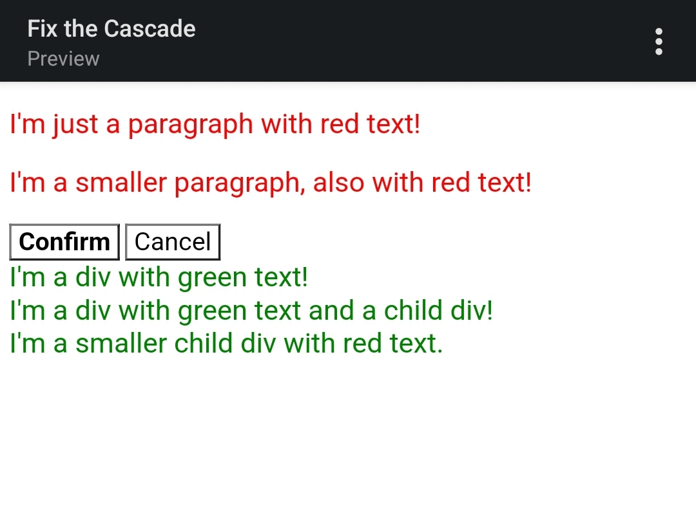
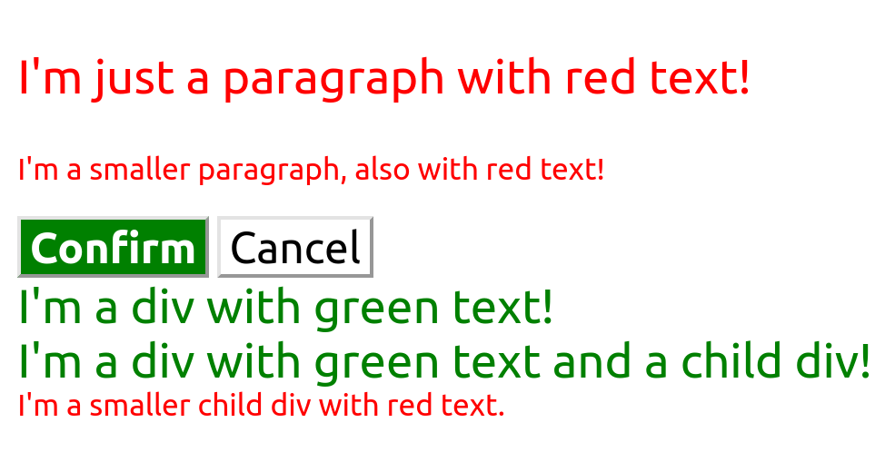

# CSS Methods
A closer look at the cascade, in particular specificity and rule order. 

There are a few elements that have some sort of specificity or rule order issue in the provided CSS file. Figuring out what issue is affecting an element, and how to fix it.

There are multiple ways to solve this exercise, and we did our best to include all of the possible solutions for each element.

It is still super helpful to see how these issues affect the final styles and why it's important to order rules carefully.

## Initial

## Desired Outcome

